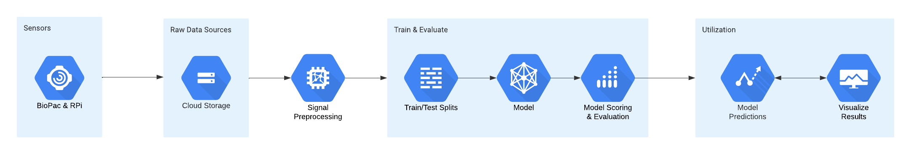
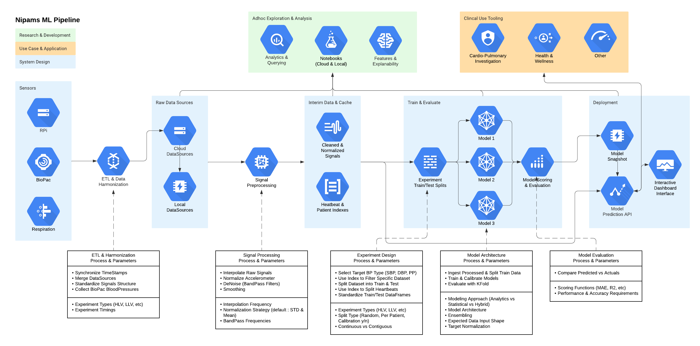

NiPAMS VCG Blood Pressure Estimation
==============================
[Work In Progress]

## Overview
Repository for all aspects of Exploratory Analysis, Processing, Modeling and Evaluation of NiPAMS Vibrational Cardiography (VCG) to Blood Pressure Estimation algoriths & system. 

Available both as a series of notebooks and/or an interactive dashboard/modeling application.

<br/>

## VCG Acquisition & Prediction Overview



<br/>


# Get Started !
## Run Analysis Engine
1. Prerequisite : Install Docker (and Docker-Compose) - https://docs.docker.com/get-docker/

1. Run the Command to Build and Deploy Interactive Application
    ```
    docker-compose up
    ```
1. Access & interact with NiPAMS Analysis Engine : 
    <!-- 1. Primary Application : http://localhost:8501/ -->
    1. Python Notebooks - Visit the following link : http://localhost:8888?token=nipams
    1. Python CLI - Run the following in terminal : `docker exec -it nipams-data-jupyterlab python`
    1. Bash (Root) - Run the following in terminal : `docker exec -it nipams-data-jupyterlab bash`

<br/>

# Development Environment Setup

## Colab
### Overview :
Uses Google-provided Colab computing platform
Recommend running larger jobs with paid Colab accounts for higher-memory.

- Notebooks
    - Run Colab Notebooks as you would normally (from Google Drive).
- Dash Application
    - Open "LifeCycle" Colab Notebook & Open Terminal
    - Run the following command to start Dash App
        ```
        python3 src/dash/index.py
        ```
    - Visit the link
- VSCode Editor (Online)
    - Open "LifeCycle" Colab Notebook & Open Terminal
    - Run the following commands to setup the ngrok tunnel and start VSCode
    ```
    cd "{PROJECT_FOLDER}" && colabcode --port 10000 && rm install.sh    
    ```
- Git
    - Ensure the Git creds are in .env
    - Connect & Authenticate with Git

## Local Machine (Docker)
Uses Docker and DockerCompose to build disk images and run containers within Docker Engine
- Prerequisites
    - Ensure Docker Engine is running
    - Build Docker Containers
        ```
        docker-compose build 
        ```
    - Start your Engine!
        ```
        docker-compose up 
        ```
- Notebooks (JupyterLab)
    - Start App (PreReq above)
    - View logs for similar URL : http://127.0.0.1:8888/lab?token=nipams
- Dash Application
    - Start App (PreReq above)
    - Visit URL : http://0.0.0.0:8501/

<br/><br/>
------------


# System Architecture



<br/><br/>
# Nipams Code Organization

    ├── README.md          <- The top-level README for collaborators of the nipams project.
    ├── .git               <- includes .gitignore - Everything related to changelogs and version management
    ├── data
    │   ├── interim        <- Intermediate data that has been transformed (matlab files & python dataframes)
    │   ├── processed      <- The final, canonical data sets for modeling (includes interpolation).
    │   └── raw            <- Raw VCG Data from patient trials (sourced from gDrive).
    │
    ├── docs               <- Folder for sensor collection details and data dictionaries (structures, indexes, etc)
    │
    ├── models             <- Trained and serialized models and model summaries
    │
    ├── notebooks          <- Colab/Jupyter notebooks. Naming convention `<date>-<initials>-<notebook title>`.
    │
    ├── references         <- Data dictionaries, manuals, and all other explanatory materials. (includes lifecycle operations)
    │
    ├── reports            <- Generated analysis as HTML, PDF, LaTeX, etc.
    │   └── figures        <- Generated graphics and figures to be used in reporting
    │
    ├── requirements.txt   <- The requirements file for reproducing the analysis environment, e.g.
    │                         generated with `pip freeze > requirements.txt`
    │
    ├── setup.py           <- makes project pip installable (pip install -e .) so src can be imported
    ├── src                <- Source code for use in this project.
    │   ├── __init__.py    <- Makes src a Python module
    │   │
    │   ├── utils          <- Scripts for platform agnostic helpers and environments
    │   │
    │   ├── dash           <- Scripts to create interactive dashboard application
    │   │
    │   ├── data           <- Scripts to download or generate data
    │   │   └── make_dataset.py
    │   │
    │   ├── features       <- Scripts to turn raw data into features for modeling
    │   │   └── build_features.py
    │   │
    │   ├── models         <- Scripts to train models and then use trained models to make predictions
    │   │   ├── predict_model.py
    │   │   └── train_model.py
    │   │
    │   └── visualization  <- Scripts to create exploratory and results oriented visualizations
    │       └── visualize.py
    │
    ├── .env.yml           <- Environment variables and configurations for build and runtime
    ├── docker-compose.yml <- Configuration for Docker Compose for defining and running multi-container Docker applications
    └── Dockerfile         <- Dockerfile contains all the commands a user could call on the command line to assemble an image


<br/><br/>

# Life Cycle Operations

docker exec -it nipams-data-jupyterlab bash

docker exec -it nipams-data-jupyterlab python src/scripts/load_data.py -h
docker exec -it nipams-data-jupyterlab python src/scripts/load_data.py --input.folder=./data


## Loading & Preprocessing
__Description__ : The Loading & Preprocessing script will 

__Script File__ : 1_load_data.py

__Arguments__ :
- download.source
- download.out_folder
- input.folder
- input.pattern
- input.limit_files
- preprocess.type
- output.file_path

<br/>

## Graphing & Analysis
__Description__ : The Graphing & Analysis script will 

__Script File__ : 2_draw_chart.py

__Arguments__ :
- input.data_path
- input.folder
- chart.type
- chart.configuration
- output.chart_path

<br/>

## Feature & TimeSeries Vectorization
__Description__ : The Feature & TimeSeries Vectorization script will 

__Script File__ : 3_build_features.py

__Arguments__ :
- input.data_path
- feature.type
- feature.configuration
- output.file_path

<br/>

## Model Training & Prediction
__Description__ : The Model Training & Prediction script will 

__Script File__ : 4_train_model.py

__Arguments__ :
- input.data_path
- input.folder
- experiment.type
- experiment.configuration
- model.type
- model.configuration
- model.pipeline
- output.model_path
- output.results_path

<br/>

## Evaluation
__Description__ : The Evaluation script takes a trained model and experiment_split to output the resulting model __score.__

__Script__ File : 5_predict_and_evaluate.py

Arguments :
- input.data_path
- input.folder
- input.model_path
- experiment.type
- experiment.configuration
- output.model_path
- output.results_path

<br/>